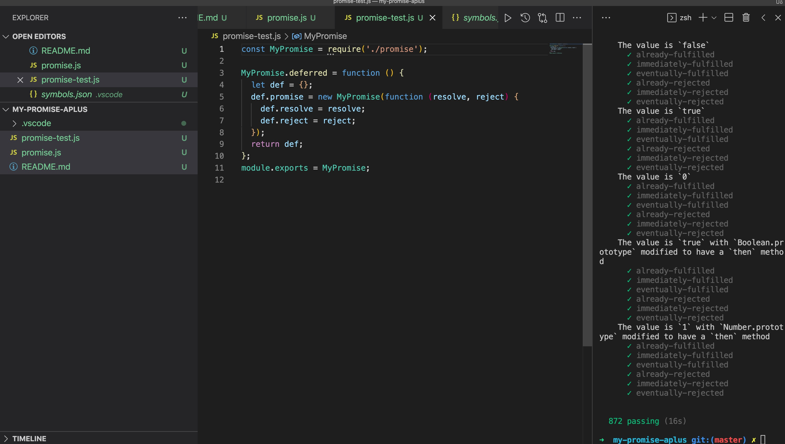

# 实现 Promise/A+ 的规范 
> 依赖 setTimeout 实现

## 行业现状
- 规范原文：https://promisesaplus.com/
- ES6 promise 是对应的实现
- [ES5 promise-polyfill](https://github.com/taylorhakes/promise-polyfill)
- 一份推荐的实现 [ysmood/yaku](https://github.com/ysmood/yaku)

## 实现
- 代码：[MyPromise](./promise.js)
- promises-aplus-tests 测试结果: 

## 规范中文翻译
### 1. 术语
  1.1. "promise" 是一个带有符合此规范的`then`方法的对象或者函数。
  1.2. "thenable" 是一个定义了一个`then`方法的对象或者函数。
  1.3. "value" 是一个任意合法的JavaScript值（包括`undefined`，`thenable`，或者`promise`）。
  1.4. "exception" 是一个使用`throw`语句抛出的值。
  1.5. "reason" 是一个指出为什么promise被rejected的值。

### 2. 要求
#### 2.1. promise 的状态
一个 promise 必须是三种状态其中的一种状态：pending, fulfilled 或者 rejected。

2.1.1. 当 promise 处于 pending 状态时：
&ensp; &ensp; 2.1.1.1. 可以转变到 fulfilled 或者 rejected 状态。

2.1.2. 当 promise 处于 fulfilled 状态时：
&ensp; &ensp; 2.1.2.1. 一定不能够转变到其他任何一种状态。
&ensp; &ensp; 2.1.2.2. 必须有一个 "value"，并且这个值一定不能改变。 

2.1.3. 当 promise 处于 rejected 状态时：
&ensp; &ensp; 2.1.3.1. 一定不能够转变到其他任何一种状态。
&ensp; &ensp; 2.1.3.2. 必须有一个 "reason"，并且这个值不能够改变。 

在这里，"一定不能够转变"意味着不可变的身份（即：`===`），但并不意味着深层不变性。（译者：对应 js 语义是value/reason指向的地址是不可变的，但假若value/reason为一个对象,则对象内的值是可变的。） 

#### 2.2. `then`方法
一个 promise 必须提供一个`then`方法去访问当前或者最终的 value 或者 reason。
一个 promise 的`then`方法接收两个参数：
```promise.then(onFulfilled, onRejected)```

2.2.1. `onFulfilled`和`onRejected`都是可选的参数：
&ensp; &ensp; 2.2.1.1. 如果`onFulfilled`不是一个函数，它必须被忽略。
&ensp; &ensp; 2.2.1.2. 如果`onRejected`不是一个函数，它必须被忽略。

2.2.2. 如果`onFulfilled`是一个函数：
&ensp; &ensp; 2.2.2.1. 它一定在`promise`是 fulfilled 状态之后被调用，并且`promise`的 value 作为它的第一个参数。
&ensp; &ensp; 2.2.2.2. 它一定不能在`promise`是 fulfilled 状态之前被调用。
&ensp; &ensp; 2.2.2.3. 它一定不能调用超过一次。

2.2.3. 如果`onRejected`是一个函数：
&ensp; &ensp; 2.2.3.1. 它一定会在`promise`是 rejected 状态之后被调用，并且`promise`的 reason 作为它的第一个参数。
&ensp; &ensp; 2.2.3.2. 它一定不会在`promise`是 rejected 状态之前被调用。
&ensp; &ensp; 2.2.3.3. 它一定不能调用超过一次。

2.2.4. 直到[执行上下文](https://es5.github.io/#x10.3)堆栈仅包含平台代码之前，`onFulfilled`或`onRejected`不能被调用。[<a href="#notes">3.1</a>]
2.2.5. `onFulfilled`和`onRejected`必须以函数的形式被调用（即：不能访问到`this`值）。[<a href="#notes">3.2</a>]

2.2.6. `then` 可以在同一个`promise`中被调用多次。
&ensp; &ensp; 2.2.6.1. 当`promise`处于 fulfilled 状态时，各个`onFulfilled`回调的执行顺序，必须按照其对应的`then`的顺序。
&ensp; &ensp; 2.2.6.2. 当`promise`处于 rejected 状态时，各个`onRejected`回调的执行顺序，必须按照其对应的`then`的顺序。

2.2.7. `then`必须返回一个 promise。[<a href="#notes">3.3</a>]
```promise2 = promise1.then(onFulfilled, onRejected);```
&ensp; &ensp; 2.2.7.1. 如果`onFulfilled`或`onRejected`返回一个值`x`，运行 Promise 决策流程`[[Resolve]](promise2, x)`。
&ensp; &ensp; 2.2.7.2. 如果`onFulfilled`或`onRejected`抛出一个异常`e`，`promise2`必须以`e`为 reason 处于 rejected 状态。
&ensp; &ensp; 2.2.7.3. 如果`onFulfilled`不是一个函数并且`promise1`处于 fulfilled 状态，`promise2`必须用和`promise1`同样的 value 转变到 fulfilled 状态。
&ensp; &ensp; 2.2.7.4. 如果`onRejected`不是一个函数并且`promise1`处于 onRejected 状态，`promise2`必须用和`promise1`同样的 reason 转变到 rejected 状态。

#### 2.3. Promise 决策流程
**Promise 决策流程**是一个抽象的操作，它把一个 promise 和一个 value 作为输入，我们将这个表示为 `[[Resolve]](promise, x)`。如果`x`是一个 thenable，它将会试图让 `promise`采用 x 的状态，前提是`x`的行为至少有点像一个 promise。否则，它将会用值`x`执行`promise`。
对这些 thenable 的处理使得与 promise 实现方式能够去互相操作。只要它们公开了符合 Promise/A+ 的`then`方法。它还使得 Promises/A+ 实现方式能够采用合理的`then`方法去“同化”不一致的实现方式。
为了运行`[[Resolve]](promise, x)`，执行以下步骤：
2.3.1. 如果`promise`与`x`是同一个对象，以`Tyeperror`作为 reason 去 reject `promise`。

2.3.2 如果`x`是一个 promise，使用它的状态：[<a href="#notes">3.4</a>]
&ensp; &ensp; 2.3.2.1. 如果`x`处于 pending 状态，`promise`必须保持 pending 状态直到`x`处于 fulfilled 或者 rejected 状态。
&ensp; &ensp; 2.3.2.2. 如果`x`处于 fulfilled 状态，以相同的 value 去 fulfill `promise`。
&ensp; &ensp; 2.3.2.3. 如果`x`处于 rejected 状态，以相同的 reason 去 reject `promise`。

2.3.3 除此之外，如果`x`是一个对象或者函数：
&ensp; &ensp; 2.3.3.1. 让`then`作为`x.then`。[<a href="#notes">3.5</a>]
&ensp; &ensp; 2.3.3.2. 如果访问属性`x.then`会导致抛出异常`e`，则以`e`为 reason reject`promise`。
&ensp; &ensp; 2.3.3.3. 如果`then`是一个函数，用`x`作为`this`来调用它，第一个参数为`resolvePromise`，第二个参数为`rejectPromise`，然后：
&ensp; &ensp; &ensp; &ensp; 2.3.3.3.1. 如果使用 value `y`调用`resolvepromise`时，运行`[[Resolve]](promise, y)`。
&ensp; &ensp; &ensp; &ensp; 2.3.3.3.2. 如果使用 reason `r`调用`rejectPromise`时，用`r` reject `promise`。
&ensp; &ensp; &ensp; &ensp; 2.3.3.3.3. 如果`resolvePromise`和`rejectPromise`都被调用了，或多次调用同一参数，那么第一个调用优先，其他的调用都会被忽略。
&ensp; &ensp; &ensp; &ensp; 2.3.3.3.4. 如果调用`then`的过程中抛出了一个意外`e`：
&ensp; &ensp; &ensp; &ensp; &ensp; &ensp; 2.3.3.3.4.1. 如果`resolvePromise`或者 `rejectPromise`被调用了，那么忽略它。
&ensp; &ensp; &ensp; &ensp; &ensp; &ensp; 2.3.3.3.4.2. 否则，把`e`作为 reason reject `promise`。
&ensp; &ensp; 2.3.3.4 如果`then`不是一个函数，将`x`作为参数去 fulfill `promise`。

2.3.4. 如果`x`不是一个对象或者函数，将`x`作为参数去 fulfill `promise`。

如果一个 thenable 循环链中的成员 thenable 去 resolve promise，这样`[[Resolve]](promise, thenable)`的递归性质最终会导致`[[Resolve]](promise, thenable)`会被再次调用，遵循上述算法将会导致无限递归。我们鼓励去实现（但不是必需的）检测这样的递归，并以一个有意义的`TypeError`作为 reason 去 reject `promise`。[<a href="#notes">3.6</a>]

### 3. <a name="notes">备注</a>
3.1. 这里的“平台代码”指的是引擎，环境和 promise 实现代码。实际上，这个要求保证了 `onFulfilled`和`onRejected`将会异步执行，在事件循环之后，用一个新的堆栈来调用`then`。 这可以通过“宏任务”机制（如`setTimeout`或`setImmediate`）或“微任务”机制（如`MutationObserver`或`process.nextick`）来实现。由于 Promise 实现被视为平台代码，因此它本身可能包含一个任务调度队列或 "trampoline"，并在其中调用处理程序。
3.2. 意味着：在 strict 模式下，`onFulfilled`和`onRejected`)内部`this`将会是`undefined`；在 sloppy 模式下，`this`将会是全局对象。
3.3. 如果实现满足所有要求，则实现可以允许 `promise2 === promise1`。每个实现都应该记录它是否能够生成 `promise2 === promise1` 以及判定的条件。
3.5. 此流程首先存储对`x.then`的引用，然后测试该引用，接着调用该引用，避免多次访问`x.then`属性。这些预防措施对于确保访问器属性的一致性非常重要，访问器属性的值可能在两次检索之间发生更改。
3.6. 实现方式中不应当在 thenbale 链中的深度设置主观的限制，并且不应当假设链的深度超过主观的限制后会是无限的。只有真正的循环才能导致`TypeError`。如果遇到由无限多个不同 thenable 组成的链，那么永远递归是正确的行为。

## 参考
[链接实现一个完美符合Promise/A+规范的Promise](https://github.com/forthealllight/blog/issues/4)
      